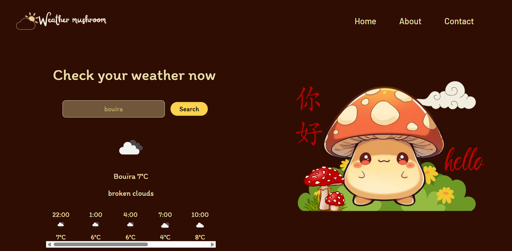

# Weather_mushroom

# Weather Mushroom 🌦️🍄
Weather Mushroom is a simple web application for checking the current weather of any location you search for. This lightweight app uses a weather API to display the temperature, weather conditions, and other basic weather information.
# Technologies Used
* HTML - Structure of the web page.
* CSS - Styling for the UI.
* JavaScript - Handles the API requests and updates the UI with weather data.
* Weather API - Provides the weather data for locations.
### In devlopment 💻⌨️
* website V1 in devlopment
* app soon
## Screenshots :
### Website V1.0
| Image 1           |  
|-------------------|
| |

### V 2.0
# Gallery

| Image 1           | Image 2           | 
|-------------------|-------------------|
|  |  |
|  |  |

### Application:
......[coming soon}
